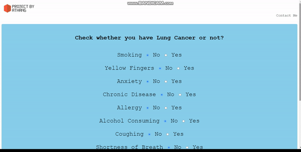
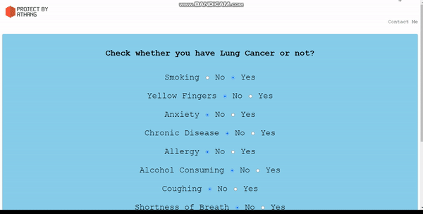

# Lung Cancer Prediction using Machine Learning


This system utilizes Machine Learning techniques to predict Lung Cancer based on a set of parameters.


## Features


- Lung Cancer Prediction using Machine Learning
- Precise Output
- High Accuracy
- User Friendly UI


## Quick look of Application


## Demo








## Tech Stack


**Client:** HTML, CSS


**Server:** Flask


**Model:** Naive Bayes Classifier


## Dataset Link


<a href= "https://www.kaggle.com/datasets/mysarahmadbhat/lung-cancer">**Lung Cancer Dataset** </a>


## Run Locally


Clone the project


```bash
  git clone https://project_name
```


Go to the project directory


```bash
  cd project_name
```


Install dependencies


```cmd
  pip install flask
  pip install sklearn
```


Run the project


```cmd
  python project_name.py
```


# Hi, I'm Athang! 👋


## 🚀 About Me


I want to become a data scientist.
I'm now learning about data visualization and machine learning.


## 🔗 Connect with me
[](https://linktr.ee/Athang9)


## Other Common Github Profile Sections
👩‍💻 I'm currently working on... Machine Learning and Data Visualization


🧠 I'm currently learning... Machine Learning


👯‍♀️ I'm looking to collaborate on... Data Science Projects


🤔 I'm looking for help with... Azure and PowerBI


💬 Ask me about... Anything 


📫 How to reach me... <a href="https://linktr.ee/Athang9"> Click here </a>


😄 Pronouns... he/him

